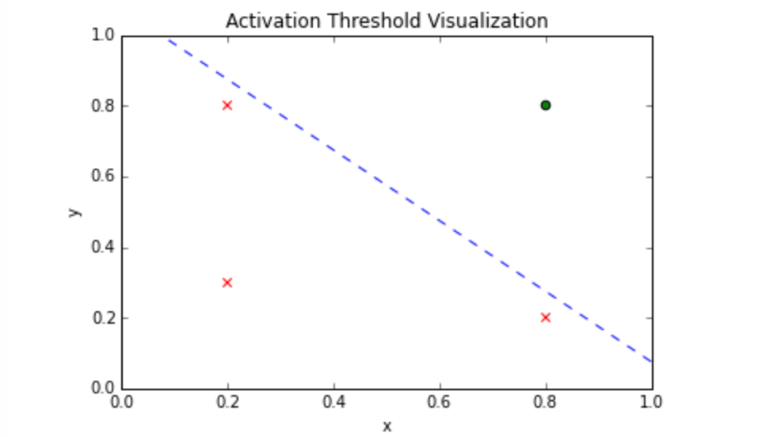

## Single-Threshold Neuron

The single-threshold neuron was first developed by McCullock-Pitts in 1940.  It uses a threshold function to transfer information from itself onward.  Each function produces an output of either 0 or 1.

The following example demonstrates the use of a single neuron to classify a series of inputs.

#### Setting the Input

For this example we'll use two input parameters (x1 and x2) with four total observations.  In this example the elements of each parameter array represent one observation.  For example, { x1[0], x2[0] } is considered one observation.  This will become apparent in the steps to come.

```
import numpy as np

x1 = np.array([0.2, 0.2, 0.8, 1.0])
x2 = np.array([0.3, 0.8, 0.2, 0.8])

inputs = np.add(x1,x2)
print 'inputs = ' + str(inputs)

```
> inputs = [ 0.5  1.  1.  1.8]

#### Configuring Weights

Normally, the net input 𝒖 to each neuron is the sum of the weighted inputs, calculated as:

∑ = 𝒖 = w₁x₁ + w₂x₂

Weights are used for learning purposes, but since the original neural networks didn't contain weights, our calculation of the net input is much simpler:

∑ = 𝒖 = x₁ + x₂

#### Activation Threshold

The activation threshold represents a decision boundary where, in this case, an input is classified as a 1 when the input value exceeds or matches the threshold and 0 when the input value is less than the threshold.  For demonstration purposed we will arbitrarily choose the threshold to be the average of the inputs.

```
activation_threshold = np.average(np.add(x1,x2))
print activation_threshold
```
> 1.075

#### Calculating Output

Now that we have all of our parameters configured we can get down to calculating the output vector, which is the set of predictions associated with each individual input vector.  In this example we iterate over each input and deduce, via the activation threshold, whether it should be classified as a 1 or a 0.

```
output = np.array([])
for i in inputs:
  if i >= activation_threshold:
    output = np.append(output, 1)
  else:
    output = np.append(output, 0)
print output
```
> [ 0.  0.  0.  1.]


#### Conclusions

Only the last input (1.0, 0.8) produces a classification of 1.  The following plot visually demonstrates the demarcation between observations that are classified as a 1 or 0.

```
%matplotlib inline
import matplotlib.pyplot as plt
from pylab import *

x = [0.2, 0.2, 0.8, 0.8]
y = [0.3, 0.8, 0.2, 0.8]

figure()
plt.autoscale(enable=False)
plt.scatter(x[0:3], y[0:3], s=30, c='r', marker='x')
plt.scatter(x[3], y[3], s=30, c='g', marker='o')
plt.plot([0, activation_threshold], [activation_threshold, 0], 'b--') # decision boundary
xlabel('x')
ylabel('y')
title('Activation Threshold Visualization')
show()
```

